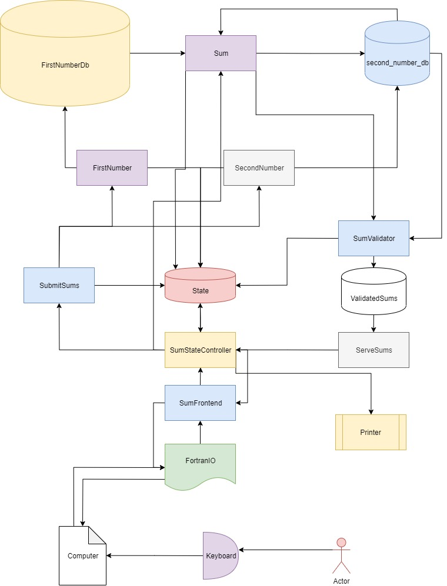

# FintechTM

Welcome to FintechTM! Here we have designed an easy to use summation state machine.

Simply run the `fortran.io frontend`, the `.NET 2 state management system`, the `python1 summation handler`, the `Windows 2003 excel FirstNumberDb` instance, the `Windows XP Mongo Managed second_number_db`, and the `Java6 Summation Validator`. Below is the simple flow diagram describing how these systems interact with eachother:

